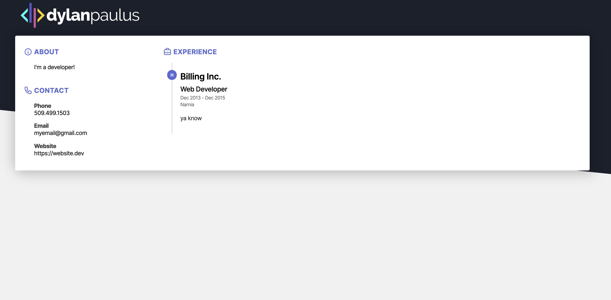

# 📜 React CV

This is a template for building CV/Resume's using React--based on [https://jsonresume.org/](json resume) as the base data structure.
Create a resume.json file inside the `src` directory, and get rolling!

## Usage

`yarn start` to start the server.
